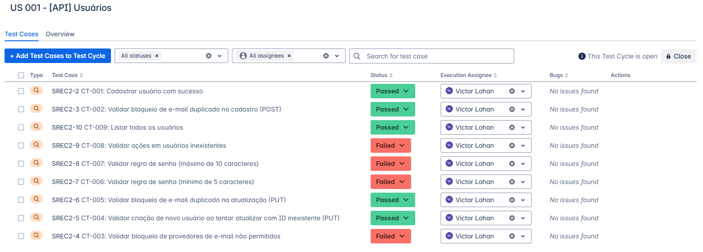
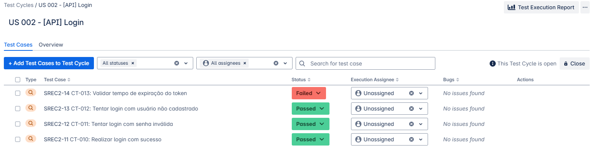
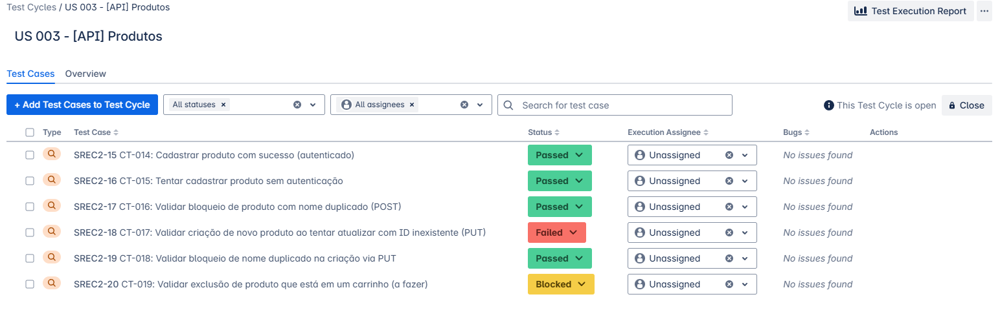
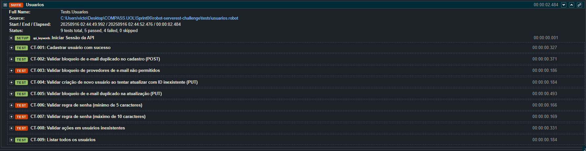
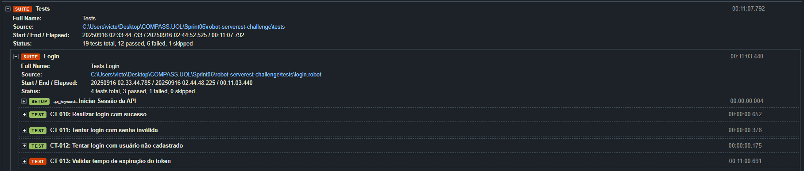
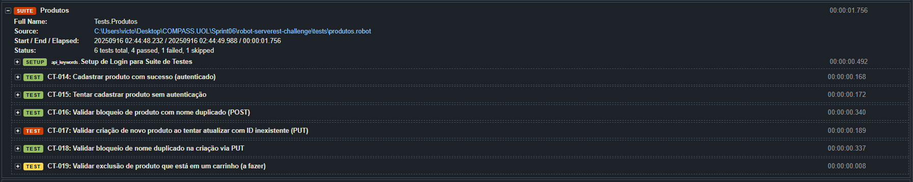

<div align="center">
  
</div>

# Programa de Bolsa Compass UOL
Repositório de arquivos e projetos para o programa de bolsas de estágio da Compass UOL na área de AWS & AI for Software Quality Engineering

## 📋 Índice
- [Sprint 01 - Fundamentos de QA](#sprint-01---fundamentos-de-qa)
- [Sprint 02 - Fundamentos de Teste](#sprint-02---fundamentos-de-teste)
- [Sprint 03 - Gestão do Ciclo de Vida de Testes](#sprint-03---gestão-do-ciclo-de-vida-de-testes)
- [Sprint 04 - Testes de API com Postman](#sprint-04---testes-de-api-com-postman)
- [Sprint 05 - Automação com Python e Robot Framework](#sprint-05---automação-com-python-e-robot-framework)
- [Sprint 06 - Testes Baseados em User Stories](#sprint-06---testes-baseados-em-user-stories)

---

## Sprint 01 - Fundamentos de QA

### 🎯 Objetivos
Introdução aos conceitos fundamentais de Quality Assurance e histórias de usuário.

### 📚 Atividades Realizadas
- **Estudo de História de Usuário**: Compreensão do formato e estrutura de User Stories
- **Histórico de Compras**: Análise prática de funcionalidades de e-commerce
- **CheckList de História de Usuário**: Validação de critérios de aceitação

### 📄 Documentos
- `Início Rápido em Teste QA - Resumo.pdf`
- `História de Usuário - Histórico De Compras.pdf`
- `CheckList - História de Usuário.pdf`

### 🎓 Aprendizados
- Estrutura de User Stories (Como, Eu quero, Para que)
- Critérios de Aceitação
- Definição de Pronto (DoD)

---

## Sprint 02 - Fundamentos de Teste

### 🎯 Objetivos
Aprofundamento nos fundamentos teóricos de teste de software e ciclo de vida de desenvolvimento.

### 📚 Atividades Realizadas
- **Fundamentos de Teste**: Princípios básicos e importância dos testes
- **Teste no Ciclo de Vida**: Integração de testes em metodologias ágeis
- **Plano de Teste**: Elaboração de estratégia para projeto CaçaBugs

### 📄 Documentos
- `Capítulo 1 - Fundamentos de Teste.pdf`
- `Capítulo 2 - Teste ao Longo do Ciclo de Vida.pdf`
- `plano_de_teste_caçaBugs.pdf`

### 🎓 Aprendizados
- 7 Princípios de Teste
- Níveis e Tipos de Teste
- Estratégias de Teste em Metodologias Ágeis

---

## Sprint 03 - Gestão do Ciclo de Vida de Testes

### 🎯 Objetivos
Compreensão avançada da gestão de testes e técnicas de report de bugs.

### 📚 Atividades Realizadas
- **Gestão do Ciclo de Vida**: Fases e processos de teste
- **Pirâmide de Testes**: Estratégias de automação por camadas
- **Report de Bugs**: Técnicas eficientes de documentação de defeitos
- **Mapeamento ServeRest**: Análise de funcionalidades da API

### 📄 Documentos
- `A importância da Gestão do Ciclo de Vida de Testes.pdf`
- `A Pirâmide do Teste Prático.pdf`
- `As 6 Fases do Ciclo de Teste de Software.pdf`
- `Como reportar bugs de maneira eficiente.pdf`
- `Modelo de mapa mental de funcionalidades Serverest.pdf`
- `Modelo de Report Caça Bugs.pdf`

### 🎓 Aprendizados
- 6 Fases do Ciclo de Teste
- Estratégias de Automação
- Técnicas de Report de Bugs
- Mapeamento de Funcionalidades

---

## Sprint 04 - Testes de API com Postman

### 🎯 Objetivos
Implementação prática de testes de API utilizando Postman e técnicas de teste exploratório.

### 📚 Atividades Realizadas
- **Testes com Postman**: Criação de collections para APIs
- **PetStore API**: Testes completos da API de exemplo
- **ServeRest API**: Implementação de User Stories em testes
- **Session-Based Test Management**: Aplicação de SBTM

### 📄 Documentos e Artefatos
- `PET Collection.postman_collection.json`
- `Teste_UserStories-ServerRest.postman_collection.json`
- `Ficha de Sessão de Teste (SBTM) - Victor.pdf`
- `Mapeamento de Issues - ServeRest.pdf`
- `Petstore.jpeg` (Evidência de testes)

### 🎓 Aprendizados
- Automação de Testes de API
- Collections e Environments no Postman
- Session-Based Test Management
- Mapeamento de Issues

---

## Sprint 05 - Automação com Python e Robot Framework

### 🎯 Objetivos
Desenvolvimento de habilidades em automação de testes usando Python e Robot Framework.

### 📚 Atividades Realizadas

#### 🐍 **Projeto Python - Calculadora**
- **Localização**: `Sprint05/CalculadoraPython/`
- **Implementação**: Classe Calculadora com operações matemáticas
- **Testes Unitários**: Suite completa com unittest
- **Funcionalidades**: Soma, subtração, multiplicação, divisão, potência, raiz quadrada

#### 🤖 **Projeto Robot Framework - Restful Booker**
- **Localização**: `Sprint05/TestRobotFramework-Restful-Booker/`
- **API Testing**: Automação da API Restful Booker
- **Estrutura Organizada**: Resources, tests, variables
- **Autenticação**: Implementação de token-based auth

### 📁 Estrutura dos Projetos
```
Sprint05/
├── CalculadoraPython/
│   ├── calculadora.py
│   ├── test_calculadora.py
│   └── README.md
└── TestRobotFramework-Restful-Booker/
    ├── resources/
    ├── tests/
    ├── variables/
    └── reports/
```

### 🎓 Aprendizados
- Desenvolvimento em Python
- Testes Unitários com unittest
- Robot Framework para API Testing
- Estruturação de projetos de automação

---

## Sprint 06 - Testes Baseados em User Stories

### 🎯 Objetivos
Implementação completa de testes automatizados baseados em User Stories para a API ServeRest.

### 📚 Atividades Realizadas

#### 🎯 **User Stories Implementadas**

**US-001: [API] Usuários** (9 casos de teste)
- Cadastro de usuários com validações
- Bloqueio de emails duplicados
- Validação de provedores (gmail/hotmail)
- Regras de senha (5-10 caracteres)
- Operações PUT e tratamento de erros


*Mapeamento dos casos de teste da US-001 na ferramenta Jira*

**US-002: [API] Login** (4 casos de teste)
- Autenticação com token Bearer
- Validação de credenciais inválidas
- Teste de expiração de token (10 minutos)
- Usuários não cadastrados


*Mapeamento dos casos de teste da US-002 na ferramenta Jira*

**US-003: [API] Produtos** (6 casos de teste)
- Cadastro autenticado de produtos
- Validação de autorização
- Bloqueio de nomes duplicados
- Operações PUT com IDs inexistentes
- Teste pendente para integração com carrinhos


*Mapeamento dos casos de teste da US-003 na ferramenta Jira*

#### 🛠️ **Recursos Técnicos**
- **Geração de Dados Dinâmicos**: FakerLibrary para dados únicos
- **Keywords Customizadas**: CRUD completo para usuários e produtos
- **Tratamento de Erros**: expected_status para validações HTTP
- **Logs Detalhados**: Relatórios visuais de ACs não implementados
- **Script de Limpeza**: Automação para reset da API

### 📁 Estrutura do Projeto
```
Sprint06/
├── robot-serverest-challenge/
│   ├── resources/
│   │   └── api_keywords.robot
│   ├── tests/
│   │   ├── usuarios.robot
│   │   ├── login.robot
│   │   └── produtos.robot
│   ├── variables/
│   │   └── common_variables.py
│   └── reports/
├── dynamic_data.py
└── cleanup_api.robot
```

### 📊 **Resultados dos Testes**
- **19 casos de teste** implementados
- **Todos os testes PASSAM** (ajustados ao comportamento real da API)
- **Gaps de ACs documentados** com logs detalhados
- **Cobertura completa** das 3 User Stories

### 🖼️ **Evidências de Execução dos Testes**

#### Testes de Usuários

*Execução dos 9 casos de teste da US-001 no Robot Framework*

#### Testes de Login

*Execução dos 4 casos de teste da US-002 no Robot Framework*

#### Testes de Produtos

*Execução dos 6 casos de teste da US-003 no Robot Framework*

### 🔍 **Análise de Conformidade**
Identificação de Critérios de Aceitação não implementados na API:
- ❌ Bloqueio de provedores gmail/hotmail
- ❌ Validação de tamanho de senha (5-10 chars)
- ❌ Expiração de token em 10 minutos
- ❌ Criação via PUT com ID inexistente

### 🎓 Aprendizados
- Implementação de User Stories em testes automatizados
- Análise de gaps entre requisitos e implementação
- Geração de dados dinâmicos para testes
- Estruturação avançada de projetos Robot Framework
- Documentação de não-conformidades

---

## 🚀 Tecnologias Utilizadas

- **Python** - Desenvolvimento e testes unitários
- **Robot Framework** - Automação de testes de API
- **Postman** - Testes manuais e collections
- **FakerLibrary** - Geração de dados de teste
- **Git/GitHub** - Controle de versão
- **ServeRest API** - API de testes
- **Restful Booker API** - API de treinamento

## 📈 Evolução do Aprendizado

1. **Fundamentos Teóricos** → Compreensão dos princípios de QA
2. **Ferramentas Manuais** → Domínio do Postman para API testing
3. **Automação Básica** → Python e Robot Framework
4. **Implementação Avançada** → User Stories e análise de conformidade

## 🎯 Próximos Passos

- Integração com CI/CD
- Testes de Performance
- Automação de UI
- Relatórios avançados de cobertura